# Project Overview

 

This is a project based on fictional scenario in which I received a request from an Investment Fund to create a report based on their needs.

### Data Source

- **Dataset**: "Apartment Prices in Poland"
- **Provided by**: Krzysztof Jamroz
- [Dataset Link](https://www.kaggle.com/datasets/krzysztofjamroz/apartment-prices-in-poland/data)

### Used Software and Technologies

- SQL Server Management Studio (SSMS)
- Power BI and Power Query

 

## Business Request

Investment Manager of the fund and his team are working on an investment strategy for the next few years. They are particularly interested in the real estate market in Poland. They would like to have an overview of the apartment sales market and its depth. The analysis should consider factors such as apartment square footage, number of rooms, building age, type and ownership rights.

They need an analysis of offers from the 15 biggest cities in Poland over the last 2 months to understand the current market situation.

 

### User Stories

| No | As a | I want | So that | Acceptance Criteria |
|---|---|---|---|---|
| 1 | Investment Manager | To access the market overview dashboard to track the number of property listings and average prices of apartments in the 15 largest cities in Poland. | I can assess Polish real estate market's attractiveness. | A Power BI report displaying data on the amount of offers and average prices of apartments. It should be interactive and enable the user to filter data based on the city. |
| 2 | Investment Analyst | To dive deeper into the data provided by market overview. | I would be able to obtain more detailed information about the factors influencing apartment prices. | Report should enable the user to go deeper into the data using “drill-through” function. |
| 3 | Investment Analyst | To analyze price on various factors like: square footage, building age, number of rooms, and ownership rights. | I can understand the relationship between apartment prices and these factors. | The report should contain prices analysis based on provided criteria. |
| 4 | Investment Manager | I want to be able to interact with the data and easily switch between pages. | So I can present and analyze the data in real time during my teams meetings. | Report should have a navigation bar providing a way to switch between pages. |

 

# Steps Applied

 

1. **Importing the Data (CSV Files) to Microsoft SSMS**

 

   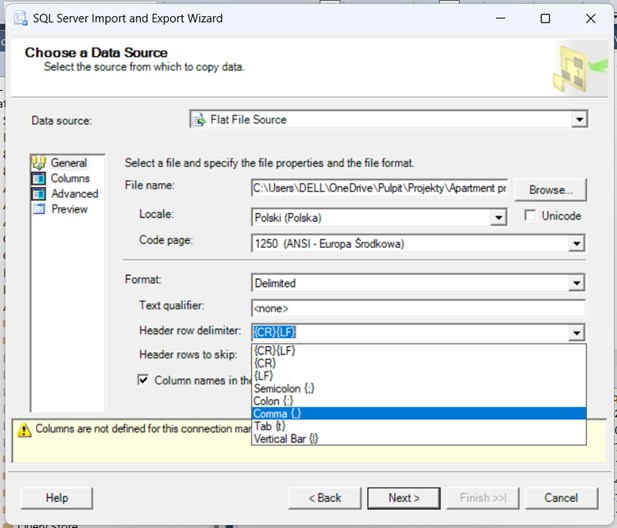
      
 

   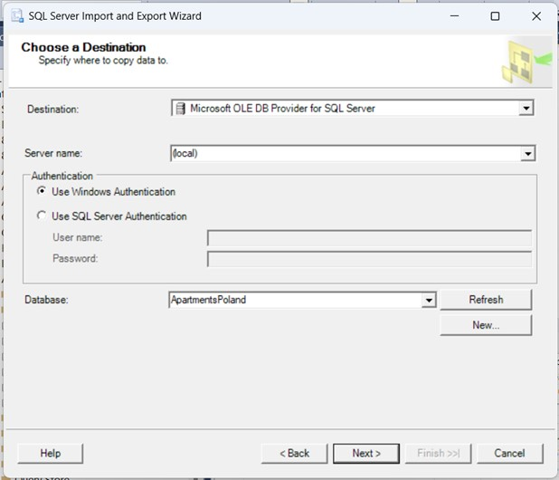
      
 

   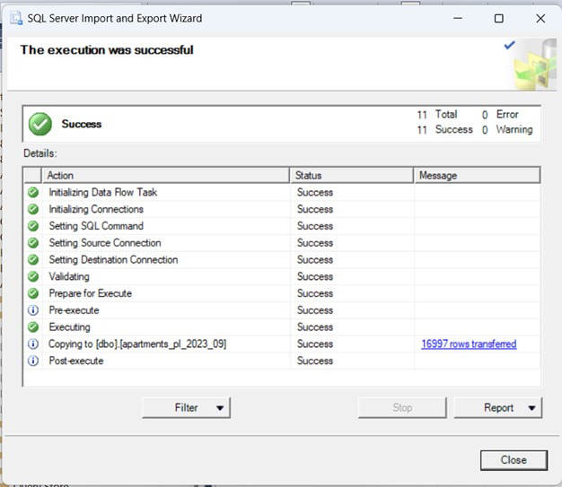

 
   
2. **Data Cleansing & Transformation**
  

 

- Created a new table with data from 3 files combined
  
 

   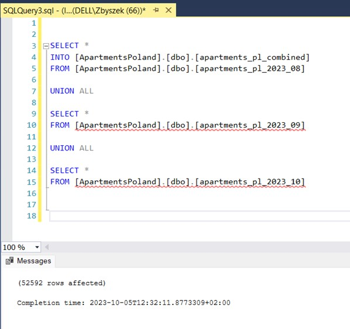
   
 

 - Explored table structure

 

   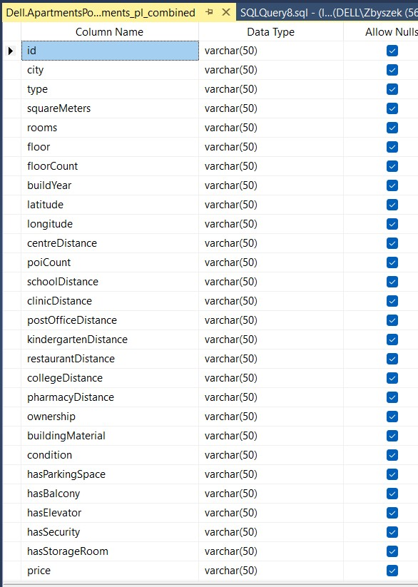
      
 

- Removed duplicates
- Created temporaty table '#temp_apartments'

 

   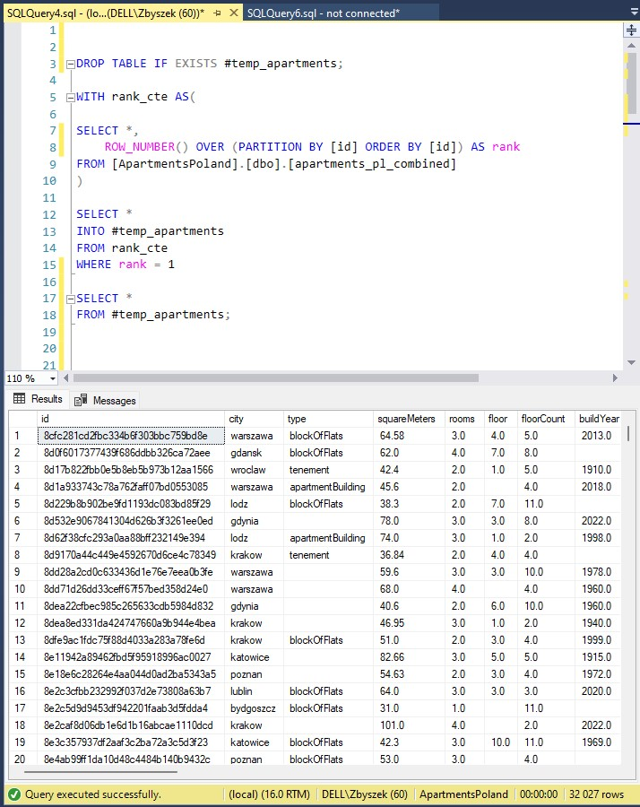
      
 

 - Changed data types 
 - Corrected inconsistent/missing values

 

   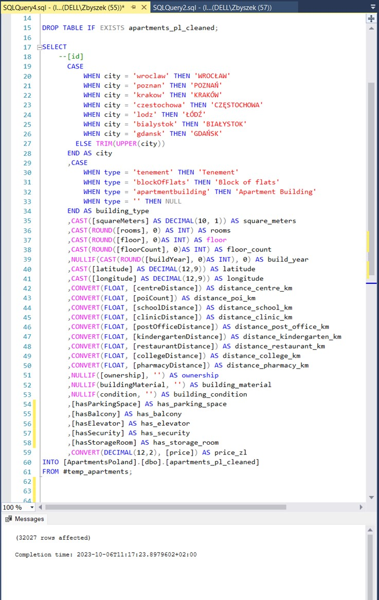

 

3. **Report Content Planning**

 

   Taking the needs of stakeholders into consideration, I planned the report content as follows:

   - ***Landing Page***
   - ***Market Overview***: Provides insights into the number of property listings and average apartment prices in the 15 largest cities in Poland. User can filter visualizations by city name and utilize the drill-through function to delve deeper into the key factors influencing prices.
   - ***Offers Analysis***: This page provides information on the number of property listings concerning apartment size, building age, number of rooms, and ownership rights.
   - ***Price Analysis***: Here, user can explore the correlations between apartment prices and various factors such as square footage, building age, number of rooms, and building type.
   - ***Key Influencers*** (accessible by 'drill-through' function)

 

4. **Creating Data Model**
   
 

   - Created 3 dimension tables to reduce redundancy:

     - DIM_Building_types
     - DIM_City
     - DIM_Ownership

 

  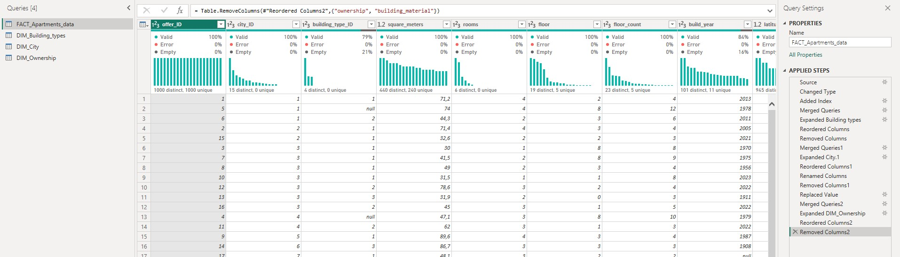

 

   - Established relationships between tables:

 
   
   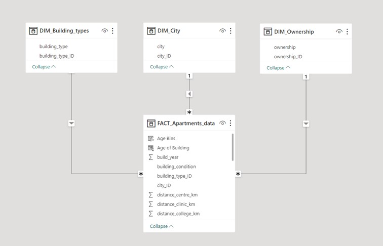

 

6. **Creating DAX Measures and Visualizations**

 

 - Types of measures used:
   
     - AVERAGE
     - COUNT
     - implicit measures: Percentage of grand total
  
   

 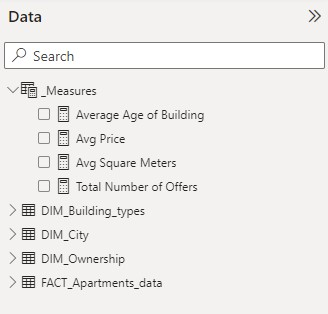

   
 
  -  Visualisations used:
    
     - Stacked bar charts
     - Stacked column charts
     - Filled map
     - Cards
     - Donut charts
     - Treemap charts
     - Scatter chart
     - Line and stacked column chart
     - Key influencers chart

 

   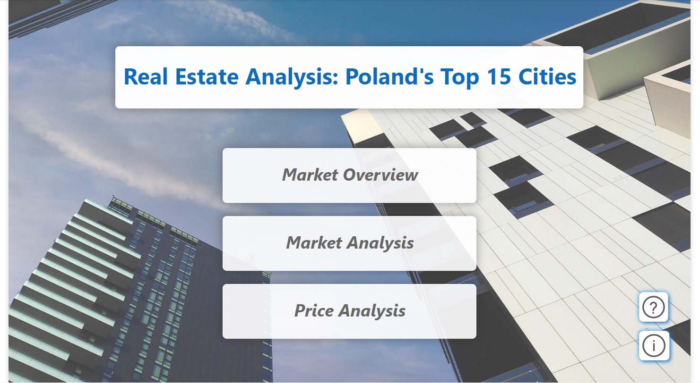
   
 

   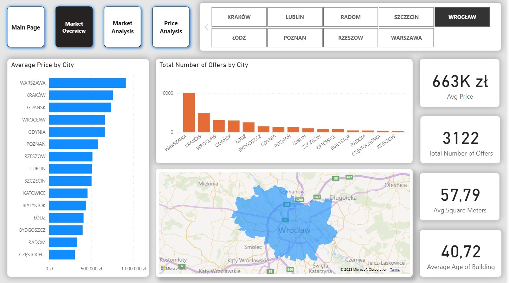
   
 

   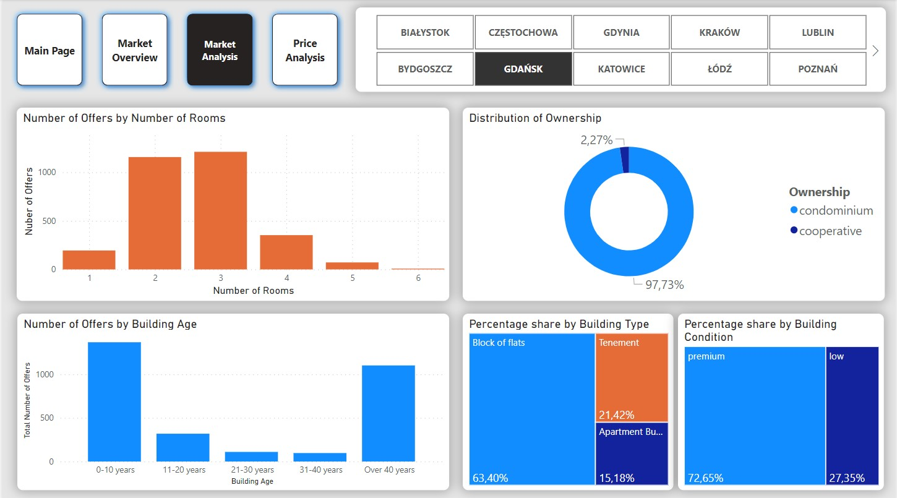
   
 

   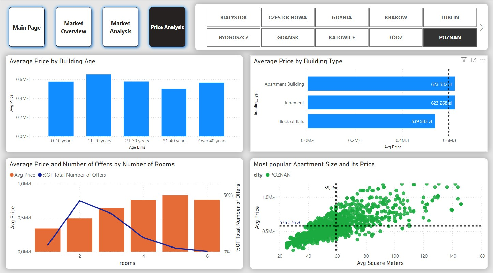
   
 

   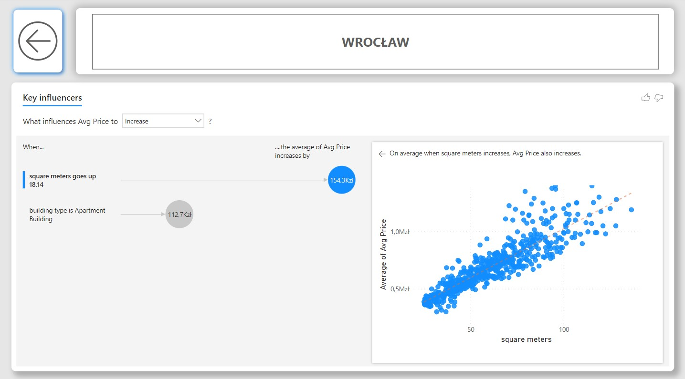
   

 

7. **Other activities**

  - Created a navigation bar
  - Created slicers for filtering data
  - Added info and help buttons with information for end-users
  - Added drill-through option to Overview page
  - Managed relationships between visuals and slicers
  - Synchronized slicers

  

# **[View Full Report Here](https://app.powerbi.com/view?r=eyJrIjoiYzc0MDViYmEtNzE2Mi00NGVmLWI4ZjgtZjNiOWRmZTFjOGNjIiwidCI6ImRmODY3OWNkLWE4MGUtNDVkOC05OWFjLWM4M2VkN2ZmOTVhMCJ9)**

  

# Final Conclusions and Key Insights

 

### Key Findings from the "Market Overview" Section

- Between September 2023 and October 2023, there were a total of 32,000 unique apartment listings throughout the country, with an average price of 698,000 PLN.
- The average apartment size stands at 57.34 square meters, varying from 51.62 to 63.61 square meters across all cities.
- The average age of buildings is 37.76 years, with Szczecin having the oldest buildings (average of 56.47 years) and Rzeszów the youngest (average of 22.93 years).
- Rzeszów records the fewest number of apartment listings, totaling just 300.
- The highest-priced apartments are situated in Warsaw, boasting an average price of 909,000 PLN.
- Conversely, the most affordable apartments can be found in Chęstochowa, with an average price of 307,000 PLN per unit.
- The average apartment price in Warsaw (the most expensive city) is nearly 20% higher than in Kraków (the second most expensive city), yet Warsaw has 48% more listings. This suggests that while prices are elevated in Warsaw, finding an apartment there may be relatively more accessible than in Kraków.

### Key Findings from the "Market Analysis" Section

- A majority of apartments feature 2 or 3 rooms.
- Approximately 90% of apartment ownership rights are categorized as condominium, with only 10% falling under cooperative ownership.
- Most apartments are situated in buildings aged between 0-10 years and over 40 years. This indicates a resurgence in new investments over the last decade, following nearly three decades of limited interest.
- Buildings are predominantly divided between low (60%) and premium (40%) conditions. However, it's important to note that the provided data included only these two categories, potentially limiting the accuracy of our conclusions due to the absence of other descriptive values.
- The most prevalent types of apartments are flats in blocks (59%) and tenements (31%), with apartment buildings making up only 9%. This suggests that further investigation is warranted, as the market may be underdeveloped in this context.

### Key Findings from the "Price Analysis" Section

- Apartments in buildings aged 11-20 years tend to be, on average, more expensive than newer ones in cities like Katowice, Łódź, Radom, and Częstochowa.
- The average price of an apartment in an apartment building is 919,558 PLN, while in a tenement, it is 738,876 PLN, and in a block, it is 612,903 PLN. However, these values exhibit significant variations among cities.
- The most common apartment size is 53.50 square meters, with an average price of 630,000 PLN.
- One-room apartments account for only 6.27% of the total listings, suggesting potentially high demand for this category.

 

  
## Disclaimer

The information presented in this report is not intended for any commercial or business application but rather for educational and skill demonstration purposes. The data used in this report is sourced from the "Apartment Prices in Poland" dataset available on Kaggle, and any insights or findings derived from it are not considered as actual business recommendations.

 
